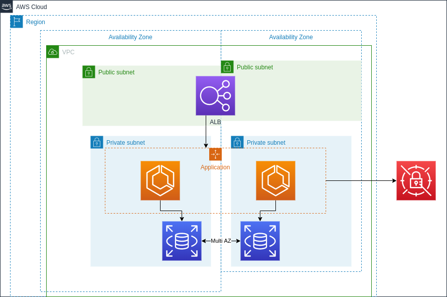

# Infrastructure 

## Architecture


## High level overview
 - Multi AZ setup
 - Application runs in ECS and scales based on inbound request count
 - Application pulls values from Secrets manager to connect to the database
 - Database in in a multi-AZ configuration

## Pre-requisites
- nodejs and npm
  - If you are on Linux, [nvm](https://github.com/nvm-sh/nvm) can be used to install specific versions of node, alternatively the latest version can be installed from the [official website](https://nodejs.org/en/)
  - This has been tested on node 12 and node 14
- AWS credentials configured
  - If you do not have these configured, please follow the [AWS documentation](https://docs.aws.amazon.com/cli/latest/userguide/cli-chap-configure.html) to ensure you can successfully authenticate.
  - Specific IAM permissions have not been tested, however please ensure you have access to:
    - Cloudformation
      - Create and modify stacks
    - IAM
      - Create and modify roles
    - ECS
      - Create and modify task definitions, services and clusters
    - EC2
      - Create and modify VPC's, NAT gateways, internet gateways, route tables, security groups, 
    - Elastic Load Balancing
      - Create and modify application load balancers, listeners and target groups.
    - RDS
      - Create and modify DB instances
    - Secrets manager
      - Create a secret and a secret attachment

## Install dependencies using npm

_Note: this is to be run from the root directory of the project_

```shell
npm ci
```

## Deploy Production Stack
_Note: this is to be run from the root directory of the project_
```shell
npm run deploy:prod
```

## Deploy Test Stack
_Note: this is to be run from the root directory of the project_
```shell
npm run deploy:test
```
